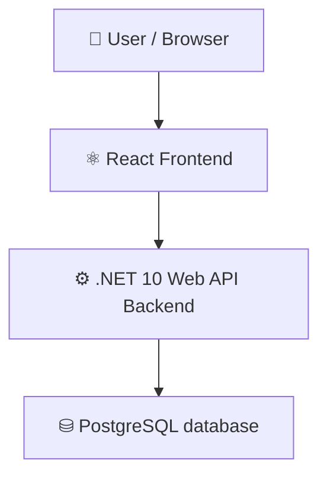

# machen

   

## 📑 Table of Contents

- [Description](#description)
- [Screenshots](#screenshots)
- [Tech Stack](#tech-stack)
- [Architecture](#architecture)
- [Quick Start](#quick-start)
- [Key Dependencies](#key-dependencies)
- [Available Scripts](#available-scripts)
- [Project Structure](#project-structure)
- [Development Setup](#development-setup)
- [Contributors](#contributors)
- [Contributing](#contributing)

## 📝 Description

machen — a fullstack todo app built with .NET, React, TypeScript, Vite, PostgreSQL.

## 📸 Screenshots


## 🛠️ Tech Stack

    

**Notable libraries:** Redux, Axios, Bootstrap

## 🏗️ Architecture

A high-level view of how the main pieces fit together:



## ⚡ Quick Start

```bash
----------------------------------------------------------------------------------
# Prerequisites: PostgreSQL must be up and running, this project assumes it is running at port 5432. (edit appsettings.json inside backend/ accordingly)
----------------------------------------------------------------------------------

# 1. Clone the repository
git clone https://github.com/ASHUdev05/machen.git

# 2. Go to frontend/ and Install dependencies
npm install

# 3. Start the dev server
npm run dev

# 4. Go to backend/ and Install dependencies and create migrations
dotnet restore && dotnet ef database update

# 5. Start the backend server
dotnet run
```

## 📦 Key Dependencies

```
@reduxjs/toolkit: ^2.12.0
axios: ^1.20.0
bootstrap: ^5.3.8
bootstrap-icons: ^1.13.1
react: ^19.2.8
react-dom: ^19.2.8
react-redux: ^9.3.0
react-router-dom: ^7.18.4
```

## 🚀 Available Scripts

- **dev** — `npm run dev`
- **build** — `npm run build`
- **lint** — `npm run lint`
- **preview** — `npm run preview`
- **run** — `dotnet run`
- **test** — `dotnet test`

## 📁 Project Structure

```
.
├── backend
│   ├── machen
│   │   ├── DTOs
│   │   │   ├── AuthResponseDto.cs
│   │   │   ├── LoginDto.cs
│   │   │   ├── RefreshTokenRequestDto.cs
│   │   │   ├── RegisterDto.cs
│   │   │   ├── ToDoMapper.cs
│   │   │   ├── ToDoRequestDto.cs
│   │   │   ├── ToDoResponseDto.cs
│   │   │   └── UserProfileDto.cs
│   │   ├── Data
│   │   │   └── AppDbContext.cs
│   │   ├── Endpoints
│   │   │   ├── AuthEndpoints.cs
│   │   │   ├── EndPointExtensions.cs
│   │   │   ├── IEndpointModule.cs
│   │   │   └── ToDoEndpoints.cs
│   │   ├── Middlewares
│   │   │   └── GlobalExceptionHandler.cs
│   │   ├── Migrations
│   │   │   ├── 20260911175305_Initial.Designer.cs
│   │   │   ├── 20260911175305_Initial.cs
│   │   │   ├── 20260913155312_Users.Designer.cs
│   │   │   ├── 20260913155312_Users.cs
│   │   │   ├── 20260914062228_UsersDbContext.Designer.cs
│   │   │   ├── 20260914062228_UsersDbContext.cs
│   │   │   └── AppDbContextModelSnapshot.cs
│   │   ├── Models
│   │   │   ├── ToDo.cs
│   │   │   └── User.cs
│   │   ├── Program.cs
│   │   ├── Properties
│   │   │   └── launchSettings.json
│   │   ├── Services
│   │   │   ├── AuthService.cs
│   │   │   ├── IAuthService.cs
│   │   │   ├── ITodoService.cs
│   │   │   └── TodoService.cs
│   │   ├── appsettings.json
│   │   ├── machen.csproj
│   │   └── machen.http
│   └── machen.slnx
└── frontend
    ├── eslint.config.js
    ├── index.html
    ├── package.json
    ├── public
    │   ├── favicon.svg
    │   └── icons.svg
    ├── src
    │   ├── App.css
    │   ├── App.tsx
    │   ├── api
    │   │   └── axios.ts
    │   ├── assets
    │   │   ├── hero.png
    │   │   ├── react.svg
    │   │   └── vite.svg
    │   ├── components
    │   │   ├── AuthForm.tsx
    │   │   ├── Navbar.tsx
    │   │   └── ToDoApp.tsx
    │   ├── index.css
    │   ├── main.tsx
    │   ├── store
    │   │   ├── authSlice.ts
    │   │   ├── store.ts
    │   │   └── todoSlice.ts
    │   └── types
    │       └── index.ts
    ├── tsconfig.app.json
    ├── tsconfig.json
    ├── tsconfig.node.json
    └── vite.config.ts
```

## 🛠️ Development Setup

### Node.js / JavaScript
1. Install Node.js (v18+ recommended)
2. Install dependencies: `npm install` (or `yarn` / `pnpm install` / `bun install`)
3. Start the dev server: see the **Quick Start** above

### .NET
1. Install the [.NET SDK](https://dotnet.microsoft.com/)
2. `dotnet restore && dotnet run`

### PostgreSQL
1. Use your preferred installation method Docker/Standalone
2. Open the backend project and run `dotnet restore && dotnet ef database update`

## 👥 Contributors

Thanks to everyone who has contributed to this project:

<p align="left">
<a href="https://github.com/ASHUdev05" title="ASHUdev05"></a>
</p>

[See the full list of contributors →](https://github.com/ASHUdev05/machen/graphs/contributors)

## 👥 Contributing

Contributions are welcome! Here's the standard flow:

1. **Fork** the repository
2. **Clone** your fork: `git clone https://github.com/ASHUdev05/machen.git`
3. **Branch**: `git checkout -b feature/your-feature`
4. **Commit**: `git commit -m 'feat: add some feature'`
5. **Push**: `git push origin feature/your-feature`
6. **Open** a pull request

Please follow the existing code style and include tests for new behavior where applicable.

---
